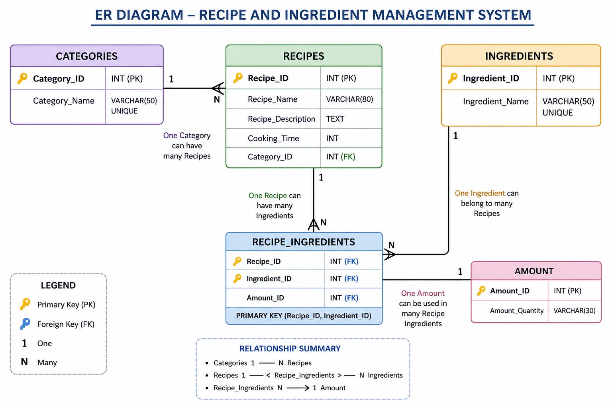
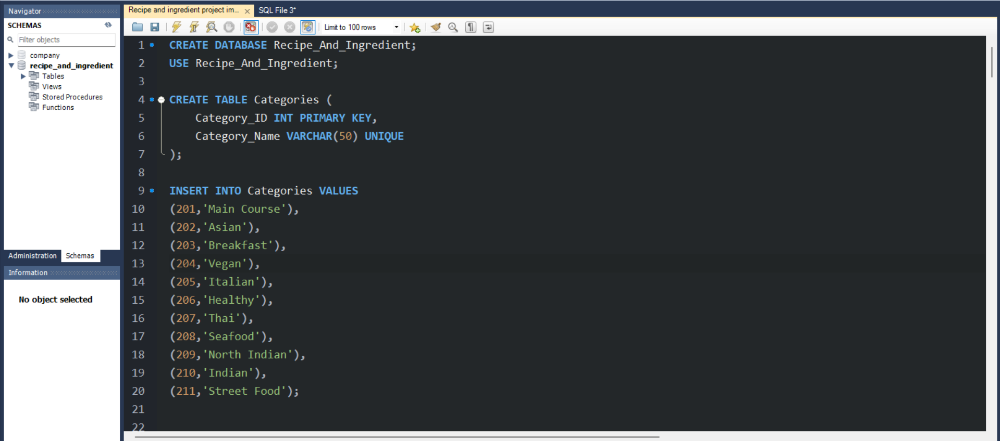
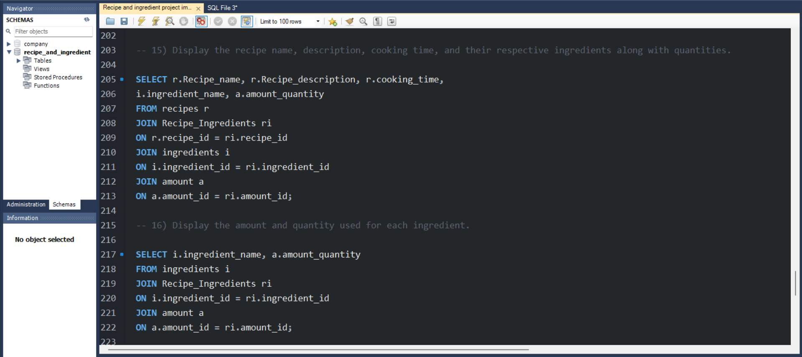
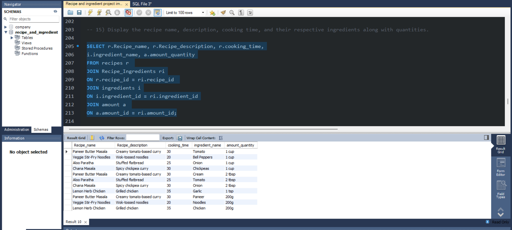
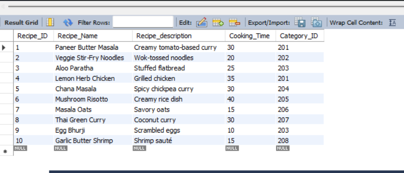

# 🍲 Recipe & Ingredient Database Project (SQL)

A structured **SQL relational database project** that manages recipes, categories, ingredients, and their quantities. This project demonstrates real-world database design using normalization and relationships between multiple tables.

---

## 📌 Project Overview

This project simulates a **Recipe Management System** where:
- Recipes belong to different categories
- Each recipe contains multiple ingredients
- Each ingredient has a specific quantity
- Relationships are handled using foreign keys and mapping tables

---

## 🛠️ Technologies Used

- SQL (MySQL / PostgreSQL compatible)
- Relational Database Design
- Joins & Subqueries
- Aggregation Functions

---

## 🗂️ Database Structure

### 1. Categories Table
Stores recipe categories.

| Column | Description |
|--------|-------------|
| Category_ID | Primary Key |
| Category_Name | Name of category |

---

### 2. Recipes Table
Stores recipe details.

| Column | Description |
|--------|-------------|
| Recipe_ID | Primary Key |
| Recipe_Name | Name of recipe |
| Recipe_description | Description |
| Cooking_Time | Time required (minutes) |
| Category_ID | Foreign Key |

---

### 3. Ingredients Table
Stores ingredient names.

| Column | Description |
|--------|-------------|
| Ingredient_ID | Primary Key |
| Ingredient_Name | Ingredient name |

---

### 4. Amount Table
Stores quantity values.

| Column | Description |
|--------|-------------|
| Amount_ID | Primary Key |
| Amount_Quantity | Quantity (e.g., 1 cup, 2 tbsp) |

---

### 5. Recipe_Ingredients Table
Mapping table connecting recipes and ingredients.

| Column | Description |
|--------|-------------|
| Recipe_ID | Foreign Key |
| Ingredient_ID | Foreign Key |
| Amount_ID | Foreign Key |
| Composite Key | (Recipe_ID, Ingredient_ID) |

---

## 🔗 Database Relationships

- One Category → Many Recipes  
- Many Recipes ↔ Many Ingredients (via Recipe_Ingredients)  
- Each ingredient has a defined quantity  

---


##📸 Screenshots







#
# 📊 Features Implemented

✔ Inserted sample dataset for recipes  
✔ Normalized relational database structure  
✔ Many-to-many relationship handling  
✔ Foreign key constraints  
✔ Real-world SQL queries  
✔ Data aggregation and filtering  

---

## 🧠 SQL Concepts Used

- CREATE DATABASE / TABLE
- PRIMARY & FOREIGN KEYS
- INNER JOIN
- GROUP BY
- COUNT / SUM / AVG
- ORDER BY
- LIKE operator
- Subqueries

---

## 📌 Sample Queries

### 🔹 Get all recipes with categories
```sql


-- 1) Display the names and descriptions of all recipes.

select Recipe_Name,Recipe_description from Recipes;


 -- 2) Display the recipes that take exactly 30 minutes to Cook.
 
select Recipe_Name,cooking_time from recipes where cooking_time=30 ;


 -- 3)Display the recipe names along with their corresponding category names.
 
select recipes.Recipe_name ,categories.category_name from
recipes inner join categories on recipes.category_ID=categories.category_ID;


-- 4)Display the category of the recipe ‘Rajma Chawal’.

select recipes.Recipe_name ,categories.category_name from recipes inner join categories on recipes.category_ID=categories.category_ID where recipe_name="Rajma Chawal";


-- 5) Count the total number of recipes available.

select count(*)from recipes;


-- 6) Display all the distinct categories used in the category table.

select category_name from categories group by category_name;


-- 7) Display the recipes along with their corresponding ingredients.

SELECT r.recipe_name, i.ingredient_name
FROM recipes r
INNER JOIN Recipe_Ingredients ri 
ON r.recipe_id = ri.recipe_id
INNER JOIN ingredients i 
ON ri.ingredient_id = i.ingredient_id;


-- 8) Count the total number of ingredients used.

select count(*) from ingredients;


-- 9) Display all distinct ingredients used in the database.

select ingredient_name from ingredients group by ingredient_name;


-- 10) Display the recipes that include 'onion' as an ingredient.
SELECT r.recipe_name, i.ingredient_name
FROM recipes r
JOIN Recipe_Ingredients ri
ON r.recipe_id = ri.recipe_id
JOIN ingredients i
ON i.ingredient_id = ri.ingredient_id
WHERE ingredient_name = 'Onion';


-- 11) Display the top 3 recipes that take the longest time to cook.

SELECT Recipe_Name, cooking_time
FROM recipes 
ORDER BY cooking_time DESC 
LIMIT 3;

-- 12) Calculate the total cooking time for all recipes combined.

select sum(cooking_time) from recipes;


-- 13) Display all recipes whose names start with the letter ‘P’.

select * from recipes where recipe_name like 'P%';


-- 14) Display the number of recipes available in each category.

select categories.category_name,count(recipes.recipe_name)
from categories inner join recipes
on recipes.category_id=categories.category_id
group by categories.category_name;


-- 15) Display the recipe name, description, cooking time, and their respective ingredients along with quantities.

SELECT r.Recipe_name, r.Recipe_description, r.cooking_time,
i.ingredient_name, a.amount_quantity
FROM recipes r 
JOIN Recipe_Ingredients ri
ON r.recipe_id = ri.recipe_id 
JOIN ingredients i
ON i.ingredient_id = ri.ingredient_id
JOIN amount a 
ON a.amount_id = ri.amount_id;

-- 16) Display the amount and quantity used for each ingredient.

SELECT i.ingredient_name, a.amount_quantity
FROM ingredients i 
JOIN Recipe_Ingredients ri
ON i.ingredient_id = ri.ingredient_id
JOIN amount a 
ON a.amount_id = ri.amount_id;

-- 17) Display all ingredients that require exactly '1 tsp' in quantity.

SELECT i.ingredient_name, a.amount_quantity
FROM ingredients i 
JOIN Recipe_Ingredients ri
ON i.ingredient_id = ri.ingredient_id
JOIN amount a 
ON a.amount_id = ri.amount_id 
WHERE amount_quantity = '1 tsp';

-- 18) Count how many ingredients are associated with each quantity value.

SELECT a.amount_quantity,
COUNT(i.ingredient_name) AS Number_of_ingredients
FROM ingredients i 
JOIN Recipe_Ingredients ri
ON i.ingredient_id = ri.ingredient_id 
JOIN amount a 
ON a.amount_id = ri.amount_id 
GROUP BY a.amount_quantity;

-- 19) Display all quantity values that end with the word ‘cup’.

select amount_quantity from amount where amount_quantity like "%cup";


-- 20) Display all recipe names in alphabetical order.

select recipe_name from recipes order by recipe_name ;


-- 21) Recipes where cooking time is greater than average cooking time
SELECT Recipe_Name FROM Recipes WHERE Cooking_Time > (SELECT AVG(Cooking_Time) FROM Recipes );


